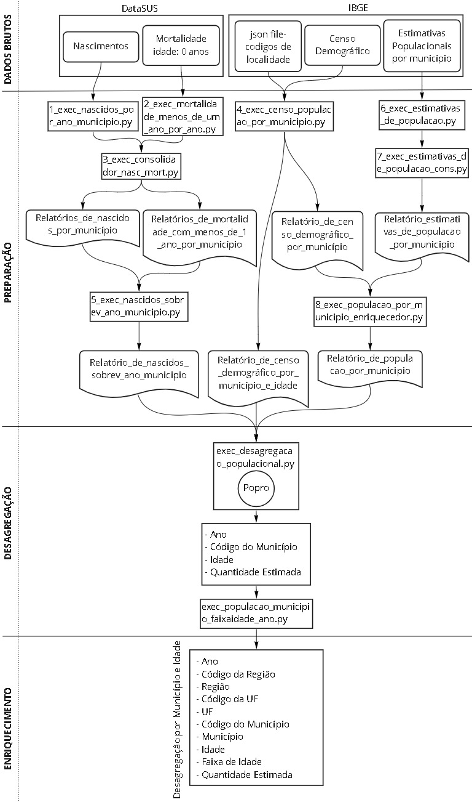
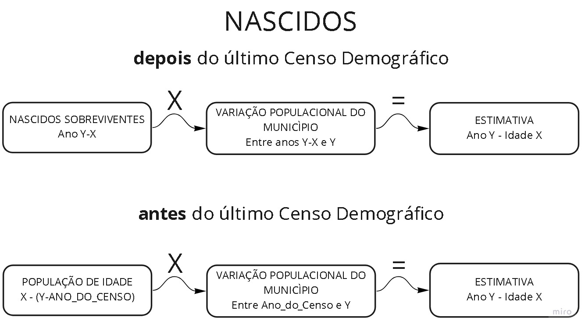

# Projeção populacional por município e idade

Por fontes oficiais do IBGE, não é obtido dados populacionais segmentado por Município e Idade. Sendo assim, uma metodologia de desagregação populacional a partir do Censo Demográfico e atualizado por dados anuais obtidos por órgãos oficiais se faz necessária.

`Imagem:` Fluxo de dados

## Fontes

- Datasus:
    - nascidos: https://datasus.saude.gov.br/nascidos-vivos-desde-1994
    - mortalidade: https://datasus.saude.gov.br/mortalidade-desde-1996-pela-cid-10
        - Filtro: faixa etária: menor 1 ano
- IBGE:
    - estimativas populacionais por município: https://ftp.ibge.gov.br/Estimativas_de_Populacao
    - Censo demográfico: https://sidra.ibge.gov.br/tabela/200
    - Extra:
        - Arquivo json de metadados capturado do fluxo de dados no navegador durante o carregamento do relatório no site do IBGE.
      `Observação:` Este arquivo é um dicionário de dados que relaciona os nomes das localidades existentes no relatório do Censo e seus códigos normalizados pelo IBGE. Este dicionário é necessário por os nomes de localidades no relatório não estarem compatíveis com as bases publicadas pelo IBGE que relaciona Nome e Código de localidade, tal como o relatório de estimativas populacionais. Assim os nomes das localidades não podem servir como chave de consolidação, sendo necessário resgatar o código da localidade.  A falta de compatibilidade se dá por variações na escrita dos nomes das localidades, como abreviações ou ausências de sinais ortográficos.

## Metodologia

`Imagem:` Metodologia Projeção Populacional

Desagregação populacional por município e idade desenvolvida pelo TCEduca e publicada na nota técnica [Memo. DAE n° 020/2021](https://www.tcesc.tc.br/sites/default/files/2021-06/Metodologia%20Estima%C3%A7%C3%A3o%20Populacional.pdf).

## ETL

- Pré processamento:  https://github.com/aiboxlab-pne/dados/tree/main/Scripts/ETL/Populacao/metodo-tceduca/notebook
    - 1 - [exec_nascidos_por_ano_municipio.py](https://github.com/aiboxlab-pne/dados/blob/main/Scripts/ETL/Populacao/metodo-tceduca/notebook/exec_nascidos_por_ano_municipio.py)
        - Limpa e tabula os relatórios de input de nascidos
    - 2 - [exec_mortalidade_menos_de_um_ano_por_ano.py](https://github.com/aiboxlab-pne/dados/blob/main/Scripts/ETL/Populacao/metodo-tceduca/notebook/exec_mortalidade_menos_de_um_ano_por_ano.py)
        - Limpa e tabula os relatórios de input de mortalidade
    - 3 - [exec_consolidador_nasc_mort.py](https://github.com/aiboxlab-pne/dados/blob/main/Scripts/ETL/Populacao/metodo-tceduca/preprocess/exec_consolidador_nasc_mort.py)
        - Objetivos:
            - Consolida os ‘diversos relatórios de cada ano’ num único relatório.
        - Output:
            - Relatórios de nascidos por município
            - Relatórios de mortalidade com menos de 1 ano  por município
    - 4 - [exec_censo_populacao_por_municipio.py](https://github.com/aiboxlab-pne/dados/blob/main/Scripts/ETL/Populacao/metodo-tceduca/preprocess/exec_censo_populacao_por_municipio.py)
        - Limpa e tabula o relatório de input do último Censo demográfico. Também enriquece com código de localidade a partir do arquivo json de metadados.
        - Output:
            - Relatório de censo demográfico por município e idade. Contém o total populacional por município segmentado por idade no ano do relatório.
            - Relatório de censo demográfico por município. Contém o total populacional por município no ano do relatório.
    - 5 - [exec_nascidos_sobrev_ano_municipio.py](https://github.com/aiboxlab-pne/dados/blob/main/Scripts/ETL/Populacao/metodo-tceduca/preprocess/exec_nascidos_sobrev_ano_municipio.py)
        - Objetivo:
            - Processa o relatório de "nascidos por idade e município" com o de "mortalidade de 0 anos por idade e município", formando o relatório "Nascidos sobreviventes por ano e município". O relatório "Nascidos sobreviventes por ano e município" serve de input para a lib [Popro](https://pypi.org/project/popro/), que realiza o processo de desagregação populacional.
        - Input:
            - Relatório "nascidos_por_ano_municipio.csv".
                - Colunas: ['ano', 'uf_codigo', 'municipio_codigo', 'quantidade']
                - Gerado via: `exec_consolidador_nasc_mort.py`
            - Relatório "mortalidade_menos_de_um_ano_por_ano_por_municipio.csv".
                - Colunas: ['ano', 'uf_codigo', 'municipio_codigo', 'quantidade']
                - Gerado via: `exec_consolidador_nasc_mort.py`
        - Output:
            - Relatório "nascidos_sobrev_ano_municipio.csv".
                - Colunas: ['ano', 'uf_codigo', 'municipio_codigo', 'nascidos_sobreviventes']
    - 6 - [exec_estimativas_de_populacao.py](https://github.com/aiboxlab-pne/dados/blob/main/Scripts/ETL/Populacao/metodo-tceduca/preprocess/Populacao%20por%20municipio/exec_estimativas_de_populacao.py)
        - Objetivos:
            - Trata e tabula relatório de "Estimativas de População" extraído do [FTP do IBGE](https://ftp.ibge.gov.br/Estimativas_de_Populacao/)
        - Input:
            - input_file_path: caminho do relatório bruto
            - year: ano do relatório
        - Output:
            - output_file_path: caminho do relatório tratado
    - 7 - [exec_estimativas_de_populacao_cons.py](https://github.com/aiboxlab-pne/dados/blob/main/Scripts/ETL/Populacao/metodo-tceduca/preprocess/Populacao%20por%20municipio/exec_estimativas_de_populacao_cons.py)
        - Objetivos:
            - Consolida todos os relatório tabulados de estimativas de população
        - Input:
            - input_folder_path: Caminho da pasta onde se encontram os relatórios tabulados de estimati vas de população
        - Output:
            - output_file_path: Relatório estimativas_de_populacao_por_municipio. Relatório csv com colunas: ['ano', 'cod_uf', 'cod_munic', 'populacao_estimada']
    - 8 - [exec_populacao_por_municipio_enriquecedor.py](https://github.com/aiboxlab-pne/dados/blob/main/Scripts/ETL/Populacao/metodo-tceduca/preprocess/exec_populacao_por_municipio_enriquecedor.py)
        - Objetivos:
            - Consolida o “Relatório de censo demográfico por município” com o relatório de “Estimativa populacional por município”, apenas para acrescer os dados populacionais do ano do Censo.
        - input:
            - file_path_estimativas_populacao:
                - Relatório csv "estimativas_de_populacao_por_municipio" contendo os dados tabulados e consolidados de estimativas de população por município, faltando os dados do ano do Censo. Colunas: ['ano', 'cod_uf', 'cod_munic', 'populacao_estimada']
            - file_path_censo_municipio:
                - Relatório csv "censo_populacao_por_municipio"  contendo os dados tabulados do censo populacional por município no ano do Censo. Colunas: ['quantidade', 'municipio_nome', 'uf_sigla', 'municipio_codigo', 'uf_codigo', 'ano']
        - Output:
            - file_path_populacao_por_municipio:
                - Relatório csv "populacao_por_municipio" contendo os dados populacionais tanto do ano do Censo quanto dos demais anos do relatório de estimativa populacional. Colunas: ['ano', 'cod_uf', 'cod_munic', 'quantidade']
- Desagregação:
    - Biblioteca: [Popro - https://pypi.org/project/popro/](https://pypi.org/project/popro/)
    - Objetivos:
        - Gerar relatório populacional desagregado por município e idade, para todos os anos existentes nos relatórios de Nascidos sobreviventes e as idades existentes no relatório do Censo.
        - Intervalo de dados:
            - Anos: 2014 a 2020.
            - Idades: 0 a 24 anos.
    - [exec_desagregacao_populacional.py](https://github.com/aiboxlab-pne/dados/blob/main/Scripts/ETL/Populacao/metodo-tceduca/package/exec_desagregacao_populacional.py)
        - Objetivos:
            - Gera dados de estimativa populacional desagregado por ano, município e idade
        - Input:
            - Nascidos sobreviventes. Colunas: ['ano', 'uf_codigo', 'municipio_codigo', 'nascidos_sobreviventes']
            - Censo demográfico por município e idade. Colunas: ['idade', 'quantidade', 'municipio_nome', 'uf_sigla', 'municipio_codigo', 'uf_codigo', 'ano']
            - População por ano e municipio: Colunas: ['ano', 'cod_uf', 'cod_munic', 'quantidade']
        - Output:
            - Estimativa populacional desagregada por ano, município e idade. Colunas: ['ano', 'municipio_codigo', 'idade', 'quantidade_estimada', 'estado_codigo']
    - Oportunidade de melhoria:
        - Ampliar fronteira de 24 anos.
            - Fronteira causada por o relatório do censo demográfico segmentar por idades únicas até 24 anos, onde depois dessa idade os dados são informados por faixas etárias.
            - Recalcular o volume populacional do censo de 2010 para cada idade, com base nos microdados amostrais e as instruções para expansão em dados universais.
            - Instrução para a expansão:
                - Acesso: [IBGE-Notas Metodológicas - Microdados da Amostra](https://ftp.ibge.gov.br/Censos/Censo_Demografico_2010/Resultados_Gerais_da_Amostra/Microdados/Documentação.zip/Notas Metodológicas - Microdados da Amostra-2010.pdf)
                - Dados de expansão
                    - Acesso: [IBGE-Expansao_xls](https://ftp.ibge.gov.br/Censos/Censo_Demografico_2010/Resultados_Gerais_da_Amostra/Expansao_xls.zip)
                - Nota: Necessita de tabela que relaciona 'área de ponderação' com código de município
- Enriquecimento com faixa de idade
    - [exec_populacao_municipio_faixaidade_ano.py](https://github.com/aiboxlab-pne/dados/blob/main/Scripts/ETL/Populacao/metodo-tceduca/package/exec_populacao_municipio_faixaidade_ano.py)
        - Objetivo: Geração de relatório projecao_da_populacao por ano, municipio e faixa de idade.
        - input:
            - Relatório projecao_da_populacao por ano, municipio e idade. Colunas: ['ano', 'municipio_codigo', 'idade', 'quantidade_estimada', 'estado_codigo']
        - output:
            - Relatório projecao_da_populacao por ano, municipio e faixa de idade. Colunas: ['ANO', 'FK_ESTADO_ID', 'FK_MUNICIPIO_ID', 'FK_FAIXAS_ETARIAS_ID', 'QUANTIDADE_ESTIMADA', 'FK_METODO_ID']

- Inserção no banco de dados:
    - [exec_gerar_fct_progracao_populacional.py](https://github.com/aiboxlab-pne/dados/blob/main/Scripts/Pipeline-%20Meta%201/08_fct_progracao_populacional/exec_gerar_fckt_progracao_populacional.py)
        - Objetivo: Criar tabela no banco de dados staging e efetua a ingestão dos dados
        - Input:
            - projecao_da_populacao_por_ano_municipio_faixaidade. Colunas: ['ANO', 'FK_ESTADO_ID', 'FK_MUNICIPIO_ID', 'FK_FAIXAS_ETARIAS_ID', 'QUANTIDADE_ESTIMADA', 'FK_METODO_ID']
 `Débito técnico:` Implantar capacidade de ingerir dados de um único novo ano.