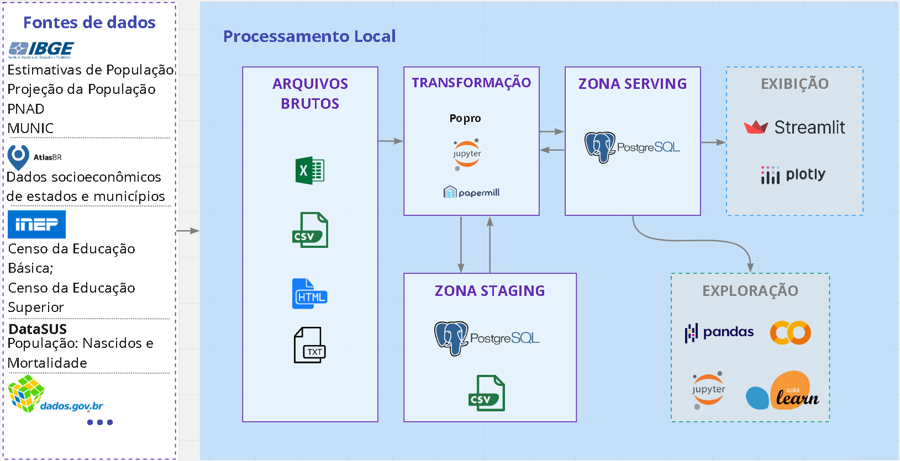
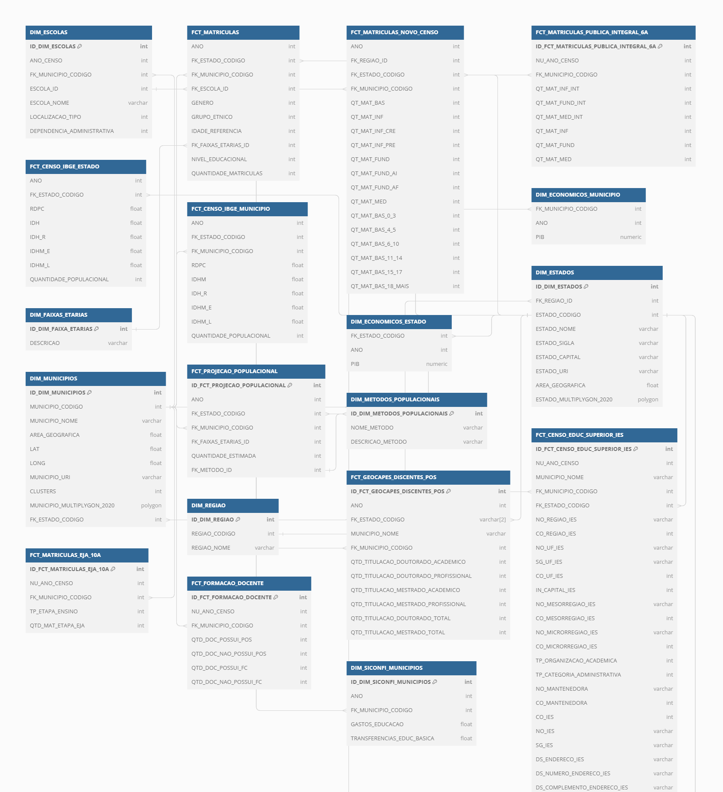
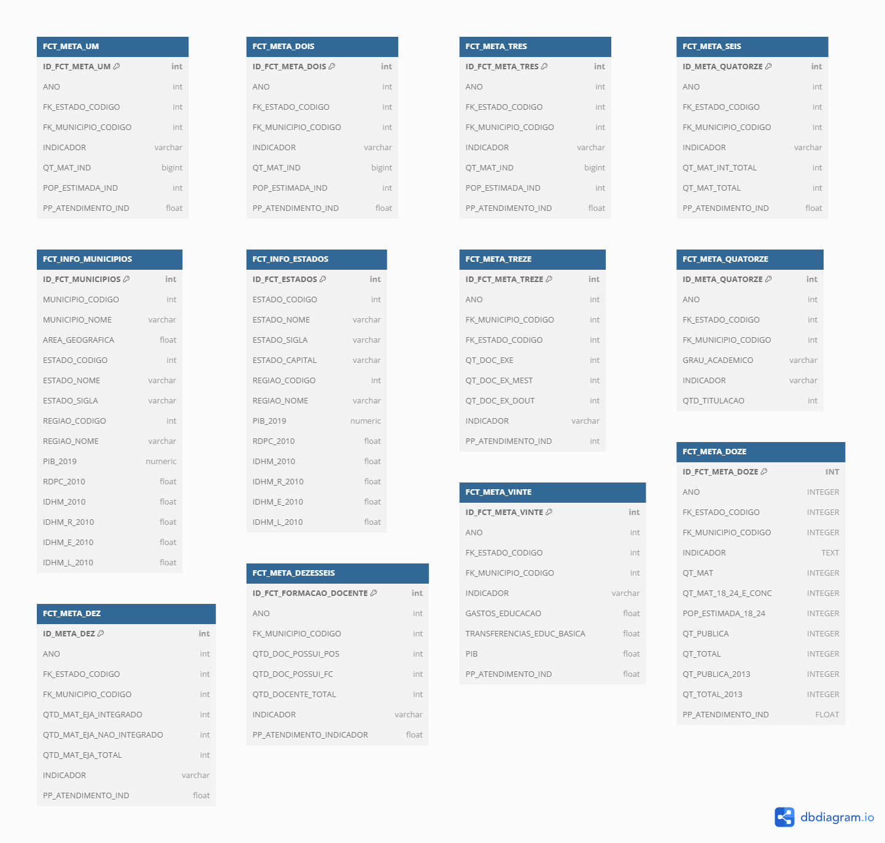

# +PNE - Team Dados

Documentação de metas, transformações e dados disponíveis

## Metas

Para cumprir o Plano Nacional de Educação (PNE) aprovado pela LEI N° 13.005/2014 com vigência de 10 anos, 20 metas totalizando 38 indicadores foram estipulados. Esta seção formaliza o processo para geração destes indicadores, detalhando fontes dos dados, suas transformações, variáveis e como são calculados.

Os nomes e descrições das metas, bem como dos indicadores, foram retirados do site [PNE em movimento](http://simec.mec.gov.br/pde/grafico_pne.php). As estratégias de cada meta podem ser lidas no portal do [PNE](https://pne.mec.gov.br/18-planos-subnacionais-de-educacao/543-plano-nacional-de-educacao-lei-n-13-005-2014).

- [Meta 1 - Educação Infantil](./meta/01)

- [Meta 2 – Ensino Fundamental](./meta/02)

- [Meta 3 – Ensino Médio](./meta/03)

- [Meta 4 – Inclusão](./meta/04)

- [Meta 5 – Alfabetização Infantil](./meta/05)

- [Meta 6 – Educação Integral](./meta/06)

- [Meta 7 – Qualidade da Educação Básica/IDEB](./meta/07)

- [Meta 8 – Elevação da escolaridade/Diversidade](./meta/08)

- [Meta 9 – Alfabetização de jovens e adultos](./meta/09)

- [Meta 10 – EJA Integrada](./meta/10)

- [Meta 11 – Educação Profissional](./meta/11)

- [Meta 12 – Educação Superior](./meta/12)

- [Meta 13 – Qualidade da Educação Superior](./meta/13)

- [Meta 14 – Pós-Graduação](./meta/14)

- [Meta 15 – Profissionais de Educação](./meta/15)

- [Meta 16 – Formação](./meta/16)

- [Meta 17 – Valorização dos Profissionais do Magistério](./meta/17)

- [Meta 18 – Planos de Carreira](./meta/18)

- [Meta 19 – Gestão Democrática](./meta/19)

- [Meta 20 – Financiamento da Educação](./meta/20)

## Transformações

- [Projeção Populacional](./etl/projecao_pop.md)

## Arquitetura

Visando manter um fluxo de coleta, transformação, ingestão e publicação de dados necessários ao projeto, a arquitetura que será apresentada está em adaptação contínua para assegurar que atende às exigências atuais das equipes que dela dependem.

Das fonte de dados, os dados educacionais são coletados do *INEP*, enquanto os dados socioeconômicos são coletados do [**AtlasBR**](http://www.atlasbrasil.org.br/). Já os dados bases de estimativas populacionais, são coletados do *IBGE*.
Os dados brutos extraídos se diferenciam entre os formatos “xlsx, csv, html ou txt”, sendo arquivados num teamdrive de acesso restrito.

As estimativas populacionais segmentadas por município e idade, são calculadas pela ferramenta [*Popro*](https://pypi.org/project/popro/), desenvolvida internamente. Tanto o processo de exploração e transformação dos dados Educacionais quanto os Populacionais são realizados com uso intenso da biblioteca [*Pandas*](https://pandas.pydata.org/), através de notebooks python onde parte deles são executados e parametrizados com uso do [*Papermill*](https://github.com/nteract/papermill). Atualmente a arquitetura de dados está em migração para o Data Build Tool ([*DBT*](https://www.getdbt.com/)) como centralizador das transformações e documentações dos dados, bem como criação e ingestão das tabelas no banco de dados..
A partir de um servidor dedicado através de conteinerização, os dados transformados são persistidos em banco de dados [*PostgreSQL*](https://www.postgresql.org/). As ontologias são persistidas com [*Ontop*](https://ontop-vkg.org/).
Por fim, as apresentações de dados são realizadas através da ferramenta [*Streamlit*](https://streamlit.io/).

## Dados disponíveis (DW)

### Data Build Tool (DBT)
Ver [documentação](./dbt/index.html)

### Staging
Ver [Dicionário de Dados](./dict/staging.md)

`Img: Diagrama DW staging`
[ver imagem completa](img/dw_staging_complete.png)

### Serving
Ver [Dicionário de Dados](./dict/serving.md)

`Img: Diagrama DW serving`

Arquivos de modelagem: [txt e sql](https://github.com/aiboxlab-pne/dados/tree/main/Modelagens%20dbdiagram/Modelagem%20Atual)

Instrução de Acesso ao DW online: [Em breve]

## Repositório GIT

[github.com/aiboxlab-pne/dados](https://github.com/aiboxlab-pne/dados)

## Equipe

* Andreza Leite - Team Leader - andreza.leite@ufrpe.br
* Abílio Nogueira - Data Engineering - abilionbarros@gmail.com
* [Déryck](https://github.com/derycck) - Data Engineering
